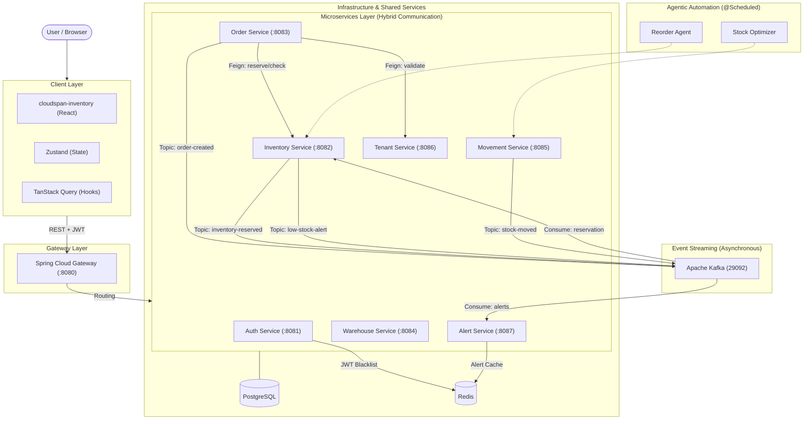

# CloudSpan InventoryOS — Central Infrastructure

> **Enterprise-grade multi-tenant inventory management platform** built with a microservices architecture and React frontend.

---

## Architecture Overview



---

## Project Structure

```
Project-root/
├── api-gateway/                  # Spring Cloud Gateway (port 8080)
├── services/
│   ├── Auth/                     # Auth service (port 8081) — JWT, OAuth2, Redis token blacklist
│   ├── Microservice1/            # Inventory service (port 8082)
│   ├── OrderSvc/                 # Order service (port 8083)
│   ├── WareHousemcs/             # Warehouse service (port 8084)
│   ├── MovementMcs/              # Stock movement service (port 8085)
│   ├── TenantMvc/                # Tenant management (port 8086)
│   ├── AlertSvc/                 # Alert + Alert Rules service (port 8087)
│   └── Billing-Payment/          # Billing service — ⏳ Deferred (awaiting API keys)
├── cloudspan-inventory/          # React frontend (Vite, port 5173)
│   ├── src/
│   │   ├── api/client.ts         # Axios instance — points to Gateway :8080, injects JWT
│   │   ├── stores/authStore.ts   # Zustand auth store — real JWT login/register/logout
│   │   ├── contexts/AuthContext.tsx
│   │   ├── components/ProtectedRoute.tsx  # Frontend Auth Middleware
│   │   ├── hooks/                # React Query data hooks
│   │   │   ├── useInventory.ts
│   │   │   ├── useOrders.ts
│   │   │   ├── useWarehouses.ts
│   │   │   ├── useMovements.ts
│   │   │   └── useAlerts.ts
│   │   ├── pages/
│   │   │   ├── LoginPage.tsx
│   │   │   ├── SignupPage.tsx     # New — calls /api/auth/register
│   │   │   ├── dashboard/        # Tenant panel
│   │   │   ├── admin/            # Admin panel
│   │   │   └── super-admin/      # Super Admin panel
│   │   └── utils/exportUtils.ts  # CSV / XLSX / PDF / JSON export (browser-only)
└── docker-compose.yml            # Unified compose — all services + Kafka + Redis + PostgreSQL
```

---

## Microservices

| Service | Port | Description | Key Endpoints |
|---------|------|-------------|---------------|
| **API Gateway** | 8080 | Single entry point, JWT validation | Routes all `/api/**` |
| **Auth** | 8081 | JWT auth, OAuth2, Redis blacklist | `POST /api/auth/register`, `/login`, `/logout`, `/me` |
| **Inventory** | 8082 | SKU management, stock levels | `GET/POST /api/v1/inventory`, `/low-stock` |
| **OrderSvc** | 8083 | Order lifecycle, Kafka events | `GET/POST /api/orders`, status updates |
| **WareHousemcs** | 8084 | Warehouse CRUD | `GET/POST /api/v1/warehouses` |
| **MovementMcs** | 8085 | Stock in/out/transfer tracking | `GET/POST /api/v1/movements` |
| **TenantMvc** | 8086 | Tenant management | `GET/POST /api/v1/tenants` |
| **AlertSvc** | 8087 | Alerts + configurable Alert Rules | `GET /api/v1/alerts/rules`, `/tenant/{id}` |
| **Billing** | 8088 | Payment & invoicing | ⏳ Deferred — API keys pending |

---

## Frontend Auth Middleware (Role-Based Access)

The frontend uses **`ProtectedRoute.tsx`** as its middleware. All panel routes are wrapped by it.

### How it works

```
User visits /admin
    │
    ├── Not logged in?         → redirect to /login (saves /admin in state)
    │
    ├── Logged in as tenant?   → redirect to /dashboard (wrong panel)
    │
    └── Logged in as admin?    → ✅ render AdminDashboard
```

### Panel Guards in `App.tsx`

```tsx
// Tenant-only routes
<Route element={<ProtectedRoute allowedRoles={["tenant"]} />}>
  <Route path="/dashboard" element={<DashboardHome />} />
  ...
</Route>

// Admin-only routes
<Route element={<ProtectedRoute allowedRoles={["admin"]} />}>
  <Route path="/admin" element={<AdminDashboard />} />
  ...
</Route>

// Super Admin-only routes
<Route element={<ProtectedRoute allowedRoles={["super_admin"]} />}>
  <Route path="/super-admin" element={<SuperAdminDashboard />} />
  ...
</Route>
```

### Role Mapping

| Backend Role | Frontend Role |
|---|---|
| `SUPER_ADMIN` / `ROLE_SUPER_ADMIN` | `super_admin` |
| `TENANT_ADMIN` / `ROLE_ADMIN` | `admin` |
| anything else | `tenant` |

---

## Auth Flow

```
Signup:  POST /api/auth/register  { firstName, lastName, email, password, tenantId, roles }
            └── Returns 201, then user navigates to /login

Login:   POST /api/auth/login  { email, password }
            └── Returns { accessToken, userId, tenantId, roles, firstName, lastName }
            └── Token stored in localStorage as `inv_access_token`
            └── All subsequent Axios requests inject:  Authorization: Bearer <token>
            └── ProtectedRoute redirects to correct panel based on role

Logout:  POST /api/auth/logout  (sends token, backend blacklists in Redis)
            └── localStorage cleared
            └── User redirected to /login
```

---

## Kafka Event Flow

| Producer | Topic | Consumer |
|----------|-------|----------|
| OrderSvc | `order-created` | Inventory (reserve stock) |
| Inventory | `inventory-reserved` | OrderSvc (confirm order) |
| Inventory | `inventory-updated` | AlertSvc (anomaly detection) |
| OrderSvc | `order-shipped` | Inventory (release reserved stock) |
| Inventory, Order, Warehouse | `*-events` | AlertSvc (low-stock, order-fail alerts) |

---

## Running Locally

### Prerequisites
- Docker & Docker Compose
- Node.js 18+
- Java 21

### Start all backend services
```bash
cd /home/sumit/Desktop/Project-root
docker-compose up -d
```

### Start frontend
```bash
cd cloudspan-inventory
npm install
npm run dev
# Open http://localhost:5173
```

### Frontend npm packages (install if first time)
```bash
npm install @tanstack/react-query xlsx jspdf jspdf-autotable file-saver
```

---

## Export Feature

The export buttons on each data table use a **browser-only client-side utility** (`exportUtils.ts`) — no backend calls.

| Format | Library |
|--------|---------|
| CSV | `xlsx` |
| Excel (.xlsx) | `xlsx` |
| PDF | `jspdf` + `jspdf-autotable` |
| JSON | Native `JSON.stringify` |

---

## Agents (Planned — Research Phase)

Six automation agents are designed and documented in `agent.md`. They are implemented as `@Scheduled` beans or `@KafkaListener` components inside existing microservices — **no external LLM API key required**.

| Agent | Lives In | Trigger |
|-------|----------|---------|
| Reorder Agent | Inventory | `@Scheduled` every 15 min |
| Demand Forecaster | Python sidecar (planned) | Weekly cron |
| Warehouse Optimizer | WareHousemcs | Daily cron 2AM |
| Order Router | OrderSvc | Kafka `order-created` |
| Stock Transfer Agent | MovementMcs | Midnight cron |
| Anomaly Detector | AlertSvc | Kafka `inventory-updated` |

---

## What's Pending

| Item | Status |
|------|--------|
| Refactor `AddOrderDialog.tsx` to use dynamic SKU selector | - Next session |
| Pagination on list endpoints (Spring Data Pageable) | - Next session |
| AI Agent implementation (Reorder, Optimizer) | - Research phase |
| Billing-Payment integration | - Deferred (no API keys) |

## ✅ Recently Completed

- **API & Hooks**: Wired live `React Query` hooks into all Page components, stripping out static mock data arrays.
- **Export Utility**: Added native browser exporting for CSV/Excel/PDF/JSON using `xlsx` and `jspdf`.
- **Auth Endpoint Improvements**: Created `PUT /api/auth/users/{id}` strictly typed endpoint to allow profile saves from the frontend Settings page.
- **Bugfixes**: Resolved backend UUID parsing conflict (Long -> String) & frontend typescript errors.

---

## Tech Stack

**Frontend:** React 18, Vite, TypeScript, TanStack Query, Zustand, Shadcn/UI, Tailwind CSS, React Router v6, Axios

**Backend:** Spring Boot 3, Spring Cloud Gateway, Spring Security + JWT, Spring Data JPA, Hibernate

**Messaging:** Apache Kafka + Zookeeper

**Storage:** PostgreSQL (per-service), Redis (token blacklist + cache)

**Infrastructure:** Docker Compose (unified), JVM memory-limited (`-Xmx256m`) for 16GB dev machine
