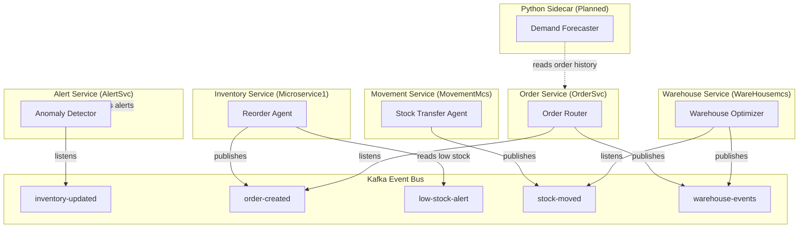
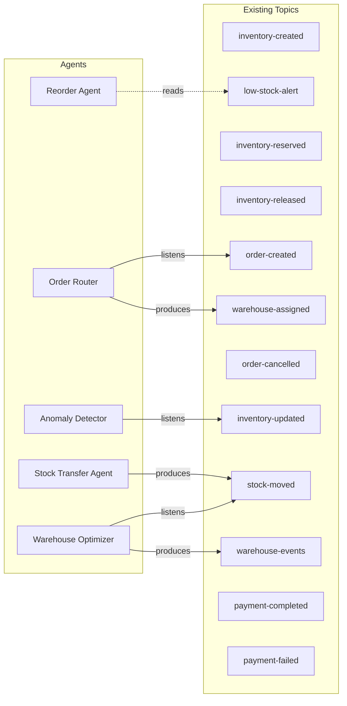

# InventoryOS — Automation Agents Design Document

> **Status:** Planned — Research Phase  
> **Last Updated:** May 2026  
> **Principle:** All agents run as `@Scheduled` beans or `@KafkaListener` components inside existing microservices. **No external LLM API key is required.** They are deterministic, rule-based automation routines.

---

## Architecture Overview



---

## Agent Summary

| # | Agent | Host Service | Trigger | Frequency |
|---|-------|-------------|---------|-----------|
| 1 | **Reorder Agent** | `Microservice1` (Inventory) | `@Scheduled` | Every 15 minutes |
| 2 | **Demand Forecaster** | Python sidecar | External cron | Weekly (Sunday 3 AM) |
| 3 | **Warehouse Optimizer** | `WareHousemcs` | `@Scheduled` | Daily at 2:00 AM |
| 4 | **Order Router** | `OrderSvc` | `@KafkaListener` on `order-created` | Real-time (event-driven) |
| 5 | **Stock Transfer Agent** | `MovementMcs` | `@Scheduled` | Daily at midnight |
| 6 | **Anomaly Detector** | `AlertSvc` | `@KafkaListener` on `inventory-updated` | Real-time (event-driven) |

---

## 1. Reorder Agent

### Purpose
Automatically detects SKUs that have fallen below their `reorderLevel` and generates purchase-order suggestions or triggers alerts. Prevents stockouts without manual monitoring.

### Host Service
`Microservice1` (Inventory Service) — has direct access to `InventoryRepository`.

### Trigger
`@Scheduled(fixedRate = 900_000)` — runs every **15 minutes**.

### Algorithm
```
FOR each tenant:
    items = inventoryRepository.findLowStockItemsByTenantId(tenantId)
    FOR each item WHERE availableQuantity <= reorderLevel:
        reorderQty = maxStockLevel - quantity
        IF reorderQty > 0:
            publish "low-stock-alert" event to Kafka
            log "Reorder suggestion: SKU={sku}, qty={reorderQty}"
```

### Kafka Topics
| Direction | Topic | Payload |
|-----------|-------|---------|
| **Produces** | `low-stock-alert` | `{ sku, tenantId, warehouseId, quantity, reorderLevel, suggestedQty }` |

### Data Dependencies
| Field | Source |
|-------|--------|
| `quantity` | `Inventory.quantity` |
| `reorderLevel` | `Inventory.reorderLevel` |
| `maxStockLevel` | `Inventory.maxStockLevel` |
| `availableQuantity` | `quantity - reservedQuantity` |

### Implementation File
```
services/Microservice1/src/main/java/com/example/microservice1/Agent/ReorderAgent.java
```

### Configuration
```yaml
agent.reorder.enabled: true
agent.reorder.interval-ms: 900000    # 15 minutes
agent.reorder.min-reorder-qty: 10    # ignore if suggestion < 10 units
```

---

## 2. Demand Forecaster

### Purpose
Analyzes historical order data to predict future demand per SKU. Outputs a forecast table that other agents (Reorder Agent, Warehouse Optimizer) can reference when making decisions.

### Host Service
**Python sidecar** (planned) — a lightweight Flask/FastAPI service that reads from the `order_db` (MySQL, read-only replica) and writes forecast results back to Redis or a `forecast` table.

### Trigger
External cron job or Kubernetes CronJob — runs **weekly on Sunday at 3:00 AM**.

### Algorithm
```python
# Simple moving average over last 4 weeks
for each sku:
    weekly_orders = query("SELECT week, SUM(quantity) FROM order_items 
                           WHERE sku = ? GROUP BY week 
                           ORDER BY week DESC LIMIT 4")
    forecast = mean(weekly_orders)
    safety_stock = std(weekly_orders) * 1.65  # 95% service level
    write_to_redis(f"forecast:{sku}", {
        "predicted_weekly_demand": forecast,
        "safety_stock": safety_stock,
        "updated_at": now()
    })
```

### Data Dependencies
| Data | Source | Access |
|------|--------|--------|
| Order history | `order_db.order_items` | Read-only SQL query |
| Output storage | Redis key `forecast:{sku}` | Write |

### Integration Points
- **Reorder Agent** reads `forecast:{sku}` from Redis to adjust `suggestedQty` based on predicted demand.
- **Warehouse Optimizer** reads forecasts to pre-position stock closer to demand centers.

### Implementation File (Planned)
```
services/demand-forecaster/
├── Dockerfile
├── requirements.txt
├── app.py
└── forecast/
    ├── model.py
    └── scheduler.py
```

---

## 3. Warehouse Optimizer

### Purpose
Balances utilization across warehouses by identifying over-utilized and under-utilized facilities and suggesting inter-warehouse stock transfers. Runs during off-peak hours to minimize operational impact.

### Host Service
`WareHousemcs` — has direct access to `WarehouseRepository` and publishes to `warehouse-events`.

### Trigger
`@Scheduled(cron = "0 0 2 * * *")` — runs **daily at 2:00 AM**.

### Algorithm
```
warehouses = warehouseRepository.findByTenantIdAndActive(tenantId, true)
avgUtilization = mean(warehouses.currentUtilization / warehouses.capacity)

FOR each warehouse:
    utilizationPct = currentUtilization / capacity
    IF utilizationPct > 0.90:                          # Over-utilized
        mark as SOURCE for outbound transfer
    ELSE IF utilizationPct < 0.30:                     # Under-utilized  
        mark as DESTINATION for inbound transfer

FOR each (source, destination) pair:
    transferQty = min(source.excess, destination.available)
    publish "warehouse-transfer-suggestion" event
    log "Suggest transfer: {transferQty} units from {source} → {destination}"
```

### Kafka Topics
| Direction | Topic | Payload |
|-----------|-------|---------|
| **Produces** | `warehouse-events` | `{ eventType: "OPTIMIZATION_SUGGESTION", source, destination, suggestedQty }` |
| **Listens** | `stock-moved` | Updates utilization when transfers complete |

### Thresholds (Configurable)
```yaml
agent.warehouse-optimizer.enabled: true
agent.warehouse-optimizer.over-utilized-pct: 0.90
agent.warehouse-optimizer.under-utilized-pct: 0.30
agent.warehouse-optimizer.min-transfer-qty: 50
```

### Implementation File
```
services/WareHousemcs/src/main/java/org/example/warehousemcs/Agent/WarehouseOptimizerAgent.java
```

---

## 4. Order Router

### Purpose
When a new order is created, this agent selects the optimal warehouse to fulfill it based on proximity, stock availability, and current utilization. Publishes a `warehouse-assigned` event so downstream services (Movement, Billing) can proceed.

### Host Service
`OrderSvc` — already has `InventoryClient` (Feign) and `OrderEventProducer` (Kafka).

### Trigger
`@KafkaListener(topics = "order-created", groupId = "order-router-agent")` — **real-time, event-driven**.

### Algorithm
```
ON order-created event:
    order = parse(event)
    candidateWarehouses = warehouseClient.getAvailableWarehouses(tenantId)

    FOR each item in order.items:
        FOR each warehouse in candidateWarehouses:
            score(warehouse) = {
                hasStock:    inventoryClient.checkAvailability(sku, qty, warehouseId) ? 100 : 0
                utilization: (1 - warehouse.currentUtilization / warehouse.capacity) * 50
                proximity:   0  # placeholder for geo-scoring (future)
            }

    bestWarehouse = candidateWarehouses.maxBy(totalScore)
    
    IF bestWarehouse != null:
        publish "warehouse-assigned" event { orderId, warehouseId, warehouseCode }
        update order.warehouseId = bestWarehouse.id
    ELSE:
        publish "order-routing-failed" alert
```

### Kafka Topics
| Direction | Topic | Payload |
|-----------|-------|---------|
| **Listens** | `order-created` | `{ orderId, orderNumber, tenantId, items[] }` |
| **Produces** | `warehouse-assigned` | `{ orderId, warehouseId, warehouseCode, assignedAt }` |

### Feign Clients Required
| Client | Endpoint | Purpose |
|--------|----------|---------|
| `WarehouseClient` | `GET /api/v1/warehouses/available` | List warehouses with spare capacity |
| `InventoryClient` | `GET /api/v1/inventory/{sku}/availability` | Check if SKU is in stock at a warehouse |

### Implementation File
```
services/OrderSvc/src/main/java/org/example/Agent/OrderRouterAgent.java
```

---

## 5. Stock Transfer Agent

### Purpose
Scans all warehouses at midnight and generates automated `TRANSFER` movements for SKUs that are overstocked in one warehouse and understocked in another within the same tenant.

### Host Service
`MovementMcs` — has direct access to `MovementRepository` and `KafkaEventProducer`.

### Trigger
`@Scheduled(cron = "0 0 0 * * *")` — runs **daily at midnight**.

### Algorithm
```
FOR each tenant:
    inventoryByWarehouse = inventoryClient.getAllGroupedByWarehouse(tenantId)
    
    FOR each sku:
        overStocked  = warehouses WHERE item.quantity > (item.maxStockLevel * 0.85)
        underStocked = warehouses WHERE item.quantity < item.reorderLevel

        FOR each (source ∈ overStocked, dest ∈ underStocked):
            transferQty = min(
                source.quantity - source.reorderLevel,    # don't drain below reorder
                dest.maxStockLevel - dest.quantity         # don't exceed max
            )
            IF transferQty >= minTransferQty:
                create Movement {
                    movementType: TRANSFER,
                    productId: item.productId,
                    warehouseId: source.warehouseId,
                    fromLocation: source.warehouseCode,
                    toLocation: dest.warehouseCode,
                    quantity: transferQty,
                    reason: "AUTO_REBALANCE",
                    performedBy: "STOCK_TRANSFER_AGENT"
                }
                publish "stock-moved" event
```

### Kafka Topics
| Direction | Topic | Payload |
|-----------|-------|---------|
| **Produces** | `stock-moved` | `{ sku, fromWarehouse, toWarehouse, quantity, movementType: TRANSFER }` |
| **Produces** | `warehouse-transfer` | `{ transferId, sourceWarehouseId, destWarehouseId, items[] }` |

### Configuration
```yaml
agent.stock-transfer.enabled: true
agent.stock-transfer.min-transfer-qty: 20
agent.stock-transfer.overstock-threshold: 0.85   # 85% of maxStockLevel
```

### Implementation File
```
services/MovementMcs/src/main/java/org/app/movementmcs/Agent/StockTransferAgent.java
```

---

## 6. Anomaly Detector

### Purpose
Monitors real-time `inventory-updated` events and flags unusual patterns such as sudden large quantity drops, negative stock, or abnormally high update frequency. Creates alerts visible on the dashboard.

### Host Service
`AlertSvc` — has direct access to `AlertService.createAlert()` and `AlertEventProducer`.

### Trigger
`@KafkaListener(topics = "inventory-updated", groupId = "anomaly-detector-agent")` — **real-time, event-driven**.

### Algorithm
```
ON inventory-updated event:
    current = event.quantity
    previous = redis.get("inventory-snapshot:{sku}")   # cached last-known value

    IF previous != null:
        delta = current - previous
        deltaPct = abs(delta) / max(previous, 1) * 100

        IF deltaPct > 50 AND abs(delta) > 100:
            createAlert {
                alertType: MOVEMENT_ANOMALY,
                severity: HIGH,
                title: "Unusual inventory change detected",
                message: "SKU {sku} changed by {delta} units ({deltaPct}%)",
                sourceService: "ANOMALY_DETECTOR",
                sourceId: sku
            }

        IF current < 0:
            createAlert {
                alertType: SYSTEM_ERROR,
                severity: CRITICAL,
                title: "Negative stock detected",
                message: "SKU {sku} has negative quantity: {current}",
                sourceService: "ANOMALY_DETECTOR"
            }

    # Update snapshot for next comparison
    redis.set("inventory-snapshot:{sku}", current, TTL = 7 days)
```

### Kafka Topics
| Direction | Topic | Payload |
|-----------|-------|---------|
| **Listens** | `inventory-updated` | Full `Inventory` entity (sku, quantity, tenantId, ...) |
| **Produces** | `alert-notification` | Via existing `AlertEventProducer.sendNotification()` |

### Detection Rules (Configurable)
| Rule | Default | Description |
|------|---------|-------------|
| `large-change-pct` | 50% | Flag if single update changes stock by > 50% |
| `large-change-abs` | 100 units | Combined with pct to avoid false positives on small items |
| `negative-stock` | Always | Any SKU going below 0 is always flagged as CRITICAL |
| `high-frequency` | 10/min | Flag if same SKU is updated > 10 times in 1 minute |

### Implementation File
```
services/AlertSvc/src/main/java/com/app/alertsvc/Agent/AnomalyDetectorAgent.java
```

---

## Kafka Topic Map (Complete)

This table shows the existing topics and how agents integrate with them:



---

## Implementation Priority

| Phase | Agent | Complexity | Business Impact | Notes |
|-------|-------|-----------|-----------------|-------|
| **Phase 1** | Reorder Agent | Low | High | Already have `findLowStockItems` — just needs a scheduler wrapper |
| **Phase 1** | Anomaly Detector | Medium | High | Kafka consumer already exists in AlertSvc — add detection rules |
| **Phase 2** | Order Router | Medium | High | Needs Feign client to Warehouse service from OrderSvc |
| **Phase 2** | Stock Transfer Agent | Medium | Medium | Needs cross-service inventory visibility |
| **Phase 3** | Warehouse Optimizer | Medium | Medium | Depends on Phase 2 transfer infrastructure |
| **Phase 4** | Demand Forecaster | High | Medium | Separate Python service, ML model training |

---

## Shared Configuration Pattern

All agents follow a consistent configuration pattern in `application.yml`:

```yaml
agent:
  reorder:
    enabled: true
    interval-ms: 900000
  warehouse-optimizer:
    enabled: true
    cron: "0 0 2 * * *"
  stock-transfer:
    enabled: true
    cron: "0 0 0 * * *"
    min-transfer-qty: 20
  anomaly-detector:
    enabled: true
    large-change-pct: 50
    large-change-abs: 100
```

Each agent checks its `enabled` flag at startup. In development or staging, agents can be disabled to avoid noise.

---

## Testing Strategy

| Agent | Test Approach |
|-------|--------------|
| Reorder Agent | Seed inventory with `quantity < reorderLevel`, assert `low-stock-alert` Kafka event is published |
| Anomaly Detector | Publish a crafted `inventory-updated` event with a 90% drop, assert an `Alert` entity is created with severity HIGH |
| Order Router | Publish `order-created` event, mock 3 warehouses with varying utilization, assert the lowest-utilization warehouse is selected |
| Stock Transfer | Seed warehouse A at 95% capacity and warehouse B at 20%, assert a TRANSFER movement is generated |
| Warehouse Optimizer | Similar to Stock Transfer but at warehouse-level utilization metrics |
| Demand Forecaster | Unit test the moving-average calculation against known order data |
