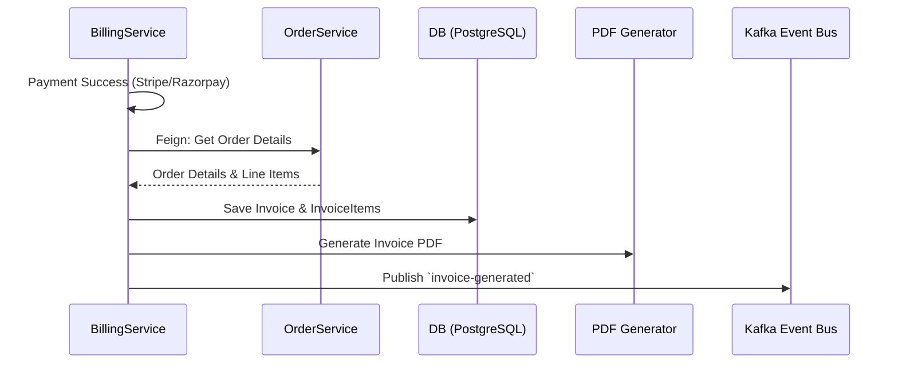
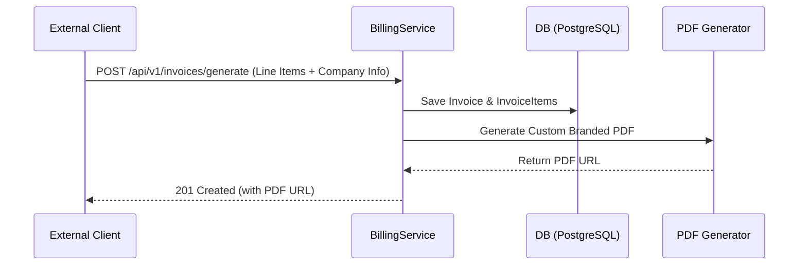

# Invoice Generation — Design and Implementation Plan

> **Status:** Planned — Design Phase
> **Last Updated:** May 2026

## Overview

The `Billing-Payment` service currently stubs out invoice creation upon successful payment (`BillingService.generateInvoiceForPayment`). However, a complete business invoice generation system requires persisting line items, generating downloadable PDFs, sending emails to customers, and accurately tracking tax and discounts.

---

## 1. Current State & Missing Pieces

### Core Logic Bug
In `BillingService.generateInvoiceForPayment`, the `Invoice` entity is built using the builder pattern, but it is never actually saved to the database. It currently instantiates and returns an empty `new Invoice();`.

### Missing Line Items
The current invoice generation does not populate the `InvoiceItem` collection. To generate a legally compliant invoice, the system needs to fetch the associated `Order` details to populate `productId`, `productName`, `quantity`, `unitPrice`, and `totalPrice`.

### PDF Generation
No PDF is currently being generated. Customers and tenants require a downloadable, branded invoice document.

### Notifications
The invoice is not sent to the customer upon generation.

---

## 2. Architecture & Workflows

To support both internal platform requirements and external businesses needing standalone billing, the service supports two distinct workflows:

### Workflow A: Integrated E-Commerce (Order-driven)
Used when a payment goes through the system linked to an existing `Order`.



### Workflow B: Standalone Billing-as-a-Service (BaaS)
Used by external businesses/clients who only want to use the invoice generation feature without processing orders or payments through the platform.



---

## 3. Implementation Steps

### Phase 1: Fix Core Persistence & Order Integration
1. **Fix `BillingService.java`**: Update `generateInvoiceForPayment` to save the built invoice using `invoiceRepository.save(invoice)`.
2. **Add Feign Client**: Add an `OrderClient` to fetch order details for **Workflow A**.
3. **Populate Invoice Items**: Map `OrderItem` to `Invoice.InvoiceItem`.

### Phase 2: Standalone BaaS API (New)
1. **Controller Endpoint**: Create `POST /api/v1/invoices/generate`.
2. **Request Payload**: Accept `StandaloneInvoiceRequest` containing raw line items, customer details, and optional overrides for `companyName`, `companyAddress`, and `taxRate`.
3. **Service Logic**: Generate the invoice directly from the payload without checking for an associated `Order` or `Payment`.

### Phase 3: PDF Generation & Download
1. **Dependency**: Add a PDF library (e.g., `openpdf` or `itext7-core`).
2. **PDF Service**: Create `InvoicePdfGenerator.java` to generate branded PDFs.
3. **Download API**: Create `GET /api/v1/invoices/{invoiceId}/download`.

### Phase 4: Customer Notification
1. **Kafka Event**: Publish an `invoice-generated` event containing the `invoiceId` and `pdfUrl`.
2. **Notification Service**: Extend `AlertSvc` to dispatch an email with the PDF attached.

---

## 4. Proposed Database Schema Updates

Add the following fields to `Invoice.java`:

```java
@Column(name = "pdf_url")
private String pdfUrl; // Link or local path to the generated PDF

@Column(name = "tax_rate", precision = 5, scale = 2)
private BigDecimal taxRate; // E.g., 0.18 for 18% GST/VAT

// For Multi-tenant/External usage support
@Column(name = "company_name")
private String companyName;

@Column(name = "company_address")
private String companyAddress;
```

---

## 5. Configuration & Multi-Tenant Support

Since the **Billing-Payment service is designed to be generic and can be used by external applications/websites**, company branding should not be hardcoded to a single entity. The service will support dynamic branding in two ways:

1. **Tenant Configuration Service**: Fetch the `company-name` and `company-address` dynamically from the `TenantMvc` service based on the `tenantId`.
2. **API Payload Overrides**: Allow external websites integrating with the billing service to pass custom branding fields during the `InitiatePaymentRequest`.

```yaml
invoice:
  pdf:
    storage-path: /var/lib/inventoryos/invoices/
    # Fallback default values if tenant/API client doesn't provide them
    default-company-name: "Default Platform Inc."
    default-tax-rate: 0.18
```

---

## Priority & Next Steps

1. **Immediate**: Fix the DB save bug in `BillingService.java` (`new Invoice()` -> `invoiceRepository.save()`).
2. **Short-term**: Implement the `OrderClient` (Feign) to retrieve line items and populate them during invoice generation.
3. **Medium-term**: Add PDF generation logic and the download API endpoint.
4. **Long-term**: Wire up the Kafka event to trigger email notifications to the end customer.
